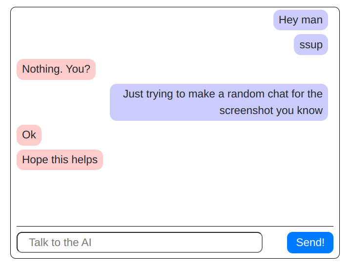

# cljs-chat

A simple Javascript chat component. The in Clojurescript

It looks like this:



## Requirements
- Bootstrap v4

## Usage
### Setup
- Download the javascript and copy it to your website's resources dir
```
curl https://github.com/philipperolet/cljs-chat/blob/main/resources/public/js/cljs-chat.js
curl https://github.com/philipperolet/cljs-chat/blob/main/resources/public/css/cljs-chat.css
```

- Include JS and CSS in HTML
```
<html>
<head>
<link href="PATH/TO/cljs-chat.css" rel="stylesheet">
...
</body>
<script src="PATH/TO/cljs-chat.js" type="text/javascript"></script>
...
</html>
```

- Add the chat component where desired in the HTML (once per app) with this line
```
<div id="cljs-chat" class="container-fluid"></div>
```
### API
The convention is that the user clicking the "Send" button is "me", talking to a remote user "you".

You can: 
- programatically post messages as users "you" and "me" (with optional callback function);
- access the full message history;
- set the full message history;
- define a callback for when user "me" clicks on UX button "Send".

```
mzero.web.chat.send_message("you", "Hello!");
mzero.web.chat.send_message("me", "Hi, what's up?", callback_fn);
mzero.web.chat.get_messages();
mzero.web.chat.set_messages([{"user": "me", "text":"yo"}, {"user": "you", "text": "lo"}])
mzero.web.chat.send_button_callback = function () {alert("hey!");};
```

### Sytle customization
The [CSS file](resources/public/css/cljs-chat.css) is very short (< 90 lines) and straightforward. It can easily be changed as you see fit.

The main CSS elements are
- ".mzero-chat" the all-encompassing div;
- ".messages" the div with the chat list;
- ".new-message" the div with the input and send button.

## About
